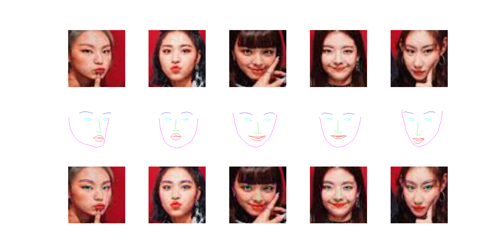

# face-utils

## Introduction
This project is an utility for alignment of a human face from an image. 

From the input image, 


Find all faces and return aligned faces and landmarks.



## Prerequisites
- Python 3.7

## Installation
```bash
git clone https://github.com/jlim262/face-utils.git
```
```bash
cd face-utils
```
```bash
pip install -r requirements.txt
```

## How to run example 
```bash
python -m face_utils.face_aligner
```

## Directory hierachy

## Known Issues
If you face the following error when you run face_aligner.py
```bash
qt.qpa.plugin: Could not find the Qt platform plugin "cocoa" in ""
This application failed to start because no Qt platform plugin could be initialized. Reinstalling the application may fix this problem.
```
please try to run this command in your terminal. 
```bash
pip install opencv-python-headless
```

## References
- [ExtractFaceChip.py](https://gist.github.com/zalo/fa4396ae7a72b7683888fd9cd1c6d920)
- [https://www.pyimagesearch.com/2017/05/22/face-alignment-with-opencv-and-python/](https://www.pyimagesearch.com/2017/05/22/face-alignment-with-opencv-and-python/)